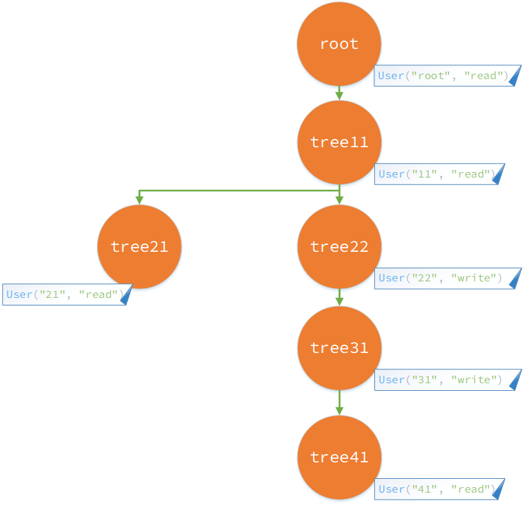

# MultilevelHierarchy

A generic tree representation in Scala 3 whose node contents are identifiable with some scope, useful to work with collection data hierarchy.

### A demo tree:


## The equivalent representation in code: 

### 1. Construction
```Scala
        val treeRoot = ResourceTree.construct(root)
        val tree11 = ResourceTree.construct(s11)
        val tree21 = ResourceTree.construct(s21)
        val tree22 = ResourceTree.construct(s22)
        val tree31 = ResourceTree.construct(s31)
        val tree41 = ResourceTree.construct(s41)
```

### 2. Tree Operations with multiple ways
```Scala
         /**
         * Tree operations using ++ operations.
         */
        val wholeTree0 = treeRoot ++ (tree11 ++ (tree21 ++ (tree31 ++ (tree41))) ++ tree22)
        val wholeTree1 = treeRoot ++ (tree11 ++ Vector(tree21 ++ (tree31 ++ tree41), tree22))

        /**
         * Tree operations using add sub-tree operation.
         */
        val wholeTree2 =
            treeRoot.addSubtree(
                tree11.addSubtree(
                    tree21.addSubtree(
                        tree31.addSubtree(
                            tree41
                        )
                    )
                ).addSubtree(
                    tree22
                )
            )

        /**
         * Tree operations using add sub-tree with given tree collections.
         */
        val wholeTree3 = ResourceTree.construct(root)
            .addSubtree(
                ResourceTree.construct(s11).addSubtree(
                    Vector(
                        ResourceTree.construct(s21)
                            .addSubtree(ResourceTree.construct(s31)
                                .addSubtree(ResourceTree.construct(s41))),
                        ResourceTree.construct(s22)
                    )))
```
